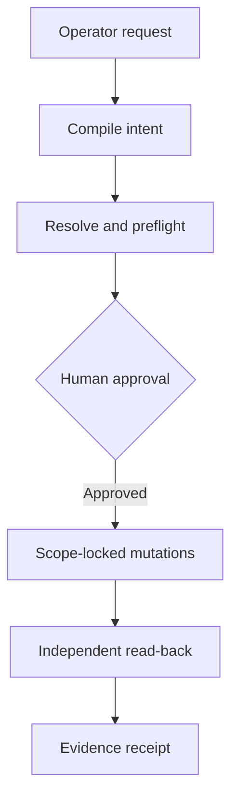

# Architecture

## Lifecycle

Every arrow is backed by a persisted row: `Run`, `Obligation`, `InvariantResult`, `EvidenceRecord`, `OperationLedgerEntry`, `RunEvent` (see `prisma/schema.prisma`). Nothing in the UI is derived from in-memory state alone — a page reload reconstructs everything from `GET /api/runs/[runId]`.

## The intent compilation boundary

`src/core/compile-intent.ts` is constrained, in both the modes below, to emit only a `CompiledIntent` JSON object validated by `CompiledIntentSchema` (Zod, `src/core/domain.ts`). The LLM:

- **cannot** propose a provider API call, URL, or action beyond the literal `"REVOKE_PROJECT_ACCESS"`;
- **cannot** invent a missing email or project slug — ambiguity becomes an `ambiguities[]` entry (one-shot mode) or a clarifying question (conversational mode), never a guess;
- **cannot** decide whether the workflow ultimately succeeded — that boundary is enforced structurally: `compile-intent.ts` has no import of `determine-status.ts`, and `execute.ts` never asks the LLM anything.

Two modes share this boundary:

- **One-shot** (`compileIntent`) — a single call for a complete instruction submitted all at once. Used by any programmatic caller of `POST /api/preflight` that doesn't go through the chat UI.
- **Conversational** (`compileIntentChatTurn`, `POST /api/intent-chat`) — the default UI flow. Each turn is still one stateless, schema-constrained call (the client resends the full message history), but the model may respond `{"action":"ASK","question":...}` instead of compiling, when required information — most commonly an exact email, since identity is never inferred from a name alone — is missing. It only emits `{"action":"COMPILED","intent":...}` once it has enough; a `COMPILED` response with a null email is rejected server-side and converted back into a question as a defense-in-depth check. Either way, the compiled intent is **not** trusted as identity — `runPreflight` still independently resolves the subject and project against each provider's real API exactly as in one-shot mode.

If the LLM is unavailable in either mode, the run is blocked (`BLOCKED: INTENT_COMPILER_UNAVAILABLE` in one-shot mode; the chat turn returns `action: "BLOCKED"`) — a deterministic fallback exists only for the single pre-seeded demo sentence in one-shot mode, purely to show what a plain parser would have extracted for troubleshooting, and it still cannot reach approval on its own merit.

## The deterministic Scope Lock

`src/core/scope-lock.ts#scopeLockCheck` is a pure function. Every provider mutation call site (`execute.ts#executeProvider`) calls it immediately before calling `provider.revokeProjectAccess(...)`, and checks, in order:

1. The target's `resourceId` is in the **approved plan's** target list (not just "looks right").
2. The resolved subject matches the approved subject exactly.
3. The resource belongs to the approved project (enforced by plan membership, not a live fuzzy match).
4. The operation type is one of the three allowlisted enum values — nothing else is ever sent.
5. The plan hash computed from the current plan snapshot equals the hash captured at approval time — if the plan changed, the check fails closed.
6. A **fresh** read of provider state (immediately before mutation) still matches what preflight observed — catches drift from someone changing access out-of-band between approval and execution.
7. The mutation is not a content-deletion operation — this is enforced even if every other check passes, and even though our adapters never construct a delete-content call in the first place; a `CONTENT_DELETION_REQUESTED` denial is a "should be impossible" backstop, not a live code path.

A denial here is not an exception bubbling up — it becomes a typed `Obligation.status = "BLOCKED"` and a ledger entry with `result: "BLOCKED"`, which is why it's evidence of restraint rather than an error page.

## The provider adapter boundary

`src/providers/types.ts#AccessProvider` is the only interface `core/*` code is allowed to call. `github.ts`, `slack.ts`, `drive.ts` each implement it against the real Octokit / `@slack/web-api` / `googleapis` SDKs — raw provider response shapes never leak past the adapter; everything crossing the boundary is one of the typed structures in `types.ts` (`AccessSnapshot`, `PreservationSnapshot`, `MutationResult`, `VerificationResult`, `InvariantResultPayload`).

This means: swapping GitHub sandbox orgs, or replacing Drive with an Arga twin that speaks the same contract, requires no change to `core/*` — only a new file implementing `AccessProvider`.

## Preflight → approval → execute → verify

- **Preflight** (`core/preflight.ts`) reads real state from all three providers *before* anything is proposed as a plan: `readProjectAccess` (current access) and `capturePreservationSnapshot` (authored content + unrelated access + other members — the invariant baseline). It builds the `ApprovedPlan` (never trusts LLM output for resource IDs — those come only from `resolveSubject`/`resolveProject` calls against the real provider).
- **Approval** (`core/execute.ts#approveRun`) mints a random approval token bound to the run. It is handed to the client once, in the approve response body — never persisted in any GET response — and is consumed atomically (`updateMany({where: {status: "APPROVED"}})`) the moment execution starts, which also serves as the concurrent-execution lock.
- **Execute** (`core/execute.ts#executeProvider`) runs the fixed sequence **READ → SCOPE LOCK → REVOKE → READ BACK → VERIFY** per provider, in GitHub → Slack → Drive order, with each provider's failure isolated — a Slack scope failure does not erase GitHub's already-recorded evidence.
- **Verify** (`core/verify.ts`) never trusts the mutation's own write response. `verifyObligationPostcondition` always performs a fresh `provider.verifyNoProjectAccess()` read; `verifyInvariants` always performs a fresh `provider.verifyPreservation()` comparison against the *before* snapshot captured at preflight.

## Evidence and status derivation

`core/evidence.ts#recordEvidence` is the single choke point for every fact that matters: it redacts (`lib/redact.ts`) before persisting, and hashes the canonicalized (`lib/ids.ts#hashCanonical`) redacted payload so evidence integrity can be spot-checked without re-fetching from the provider.

`core/determine-status.ts#determineWorkflowStatus` is a pure function over the persisted `Obligation[]` and `InvariantResult[]` rows — it takes no provider client, no network access, and is called exactly once per run, at the end of `executeRun`. The priority order (`SAFETY_VIOLATION > BLOCKED > INCOMPLETE > UNVERIFIED > COMPLETE`) means partial success can never silently upgrade to `COMPLETE`: if even one invariant read comes back `UNKNOWN` (not `PASS`), the run cannot reach `COMPLETE` — it lands on `UNVERIFIED` instead.

## Why HTTP success is not proof of final state

Three concrete failure modes this system is built to catch, that a naive "check the 2xx" implementation would miss:

1. **Eventually-consistent reads.** A provider can accept a write and still serve a stale read for some window. `verifyNoProjectAccess` treats a post-mutation read that still shows access as `FAILED` — not `VERIFIED` — because the write response is never treated as the postcondition.
2. **Partial multi-step mutations.** GitHub access can be direct *and* team-inherited; removing only the direct collaborator entry while a team still grants access would look like a successful API call while leaving real access intact. `readProjectAccess` enumerates every access path, and an obligation is only `VERIFIED` when a fresh read shows *zero* paths (or the remaining ones are `BLOCKED` as unremovable-inherited, which never resolves to `VERIFIED`).
3. **Silent scope creep.** A broader token than requested could "succeed" at removing a person from every repo in the org instead of just Phoenix. Scope Lock's plan-hash and resourceId-membership checks mean the mutation call site itself refuses to fire outside the approved, narrow target list — this is checked before the call, not audited after the fact.
